"BI cloud bez BI”, czyli jak użyć IaaS do przetwarzania BIG DATA
==================================================================

### Słowem wstępu
„Informacja” – złoto XXI wieku. Zdanie, z którym zapewne często się spotykacie, a które chyba powoli zaczyna definiować współczesne czasy. Nic nie wskazuje na to, że ten stan ulegnie zmianie. Wzrasta również świadomość wśród zarządów i właścicieli przedsiębiorstw dotycząca tego, jak ważne jest maksymalne wykorzystywanie wszystkich danych, które firma posiada – dla osiągnięcia, co oczywiste, konkurencyjnej przewagi. 

I właśnie tutaj wkracza tajemniczy skrót BI – Business Intelligence. Najprościej mówiąc, są to wszystkie procesy (i narzędzia) pozwalające na transformację danych w informację. Termin ten jest związany z kolejnym pojęciem, BIG DATA – niejednorodnym i ogromnym zbiorem danych, bardzo zmiennym i trudnym do analizy, ale będącym bezcennym źródłem wiedzy. 

Pojawiło się sporo tych terminów, a razem z nimi przyszła świadomość, że aby przedsiębiorstwo mogło się szybciej rozwijać, powinno czerpać maksymalną wiedzę z posiadanych informacji. Dzięki temu mogłoby szybciej reagować na potrzeby klientów czy nowe trendy rynku. Sytuacja byłaby idealna, gdyby nie… kilka barier.

Co zrobić, kiedy narzędzia do analizy danych – w reklamach zwane jako systemy BI są bardzo drogie i wymagają specjalistycznej wiedzy? Jak pogodzić chęć wydobycia z danych maksimum informacji, a przy okazji nie oszaleć z powodu ogromu kosztów zwiazanych z wdrożeniem takich systemów?

Czy rzeczywiście są to bariery nie do pokonania? „Przecież mnie nie stać na BI” – czy to na pewno dobry pomysł? Na te pytania postaram się opowiedzieć w tym tekście.

W tym miejscu jestem jeszcze winny jedno wyjaśnienie: dlaczego słowa BI używam w cudzysłowie? Nie będzie moim celem wyjaśnienie Wam, jak uruchomić pełnoprawne narzędzie-kombajn BI od Oracle’a, SAPa, Microsoftu czy innego gracza na rynku – choć są to świetne środowiska. Uważam, że do świata BIG DATA należy się wcześniej przygotować - mentalnie i technicznie. Chcę Wam pokazać, jak korzystając w większości z darmowych narzędzi oraz przy pomocy serwisu e24cloud.com można stworzyć pierwsze narzędzie w Waszej firmie na kształt BI, dopasowane do Waszych potrzeb. Takie, które będzie generowało koszty na akceptowalnie niskim poziomie i jednocześnie dostarczało Wam informacji – czyli wiedzy. Być może niektórzy z Was powiedzą, że nadużywam definicji BI – ja jednak będę twardo trzymał się swojego zdania, że naszym celem jest skupienie się na przetwarzaniu danych w informację – a nie zawsze do tego jest nam potrzebny moduł BI z Hurtownią Danych za tysiące dolarów.

Zanim przejdziemy do szczegółów jeszcze kilka słów o e24cloud.com. Uczestniczę w konkursie organizowanym przez chmurowisko.pl. Chciałbym Wam pokazać, jak można wykorzystać świadczone przez e24cloud.com usługi do zbudowania własnej, elastycznej infrastruktury do wykonywania analiz sporych ilości danych. Takie rozwiązanie może być naprawdę tanie. E24cloud.com może zrealizować dla Was „kawał pracy” po czym zostać wyłączone i nie generować dużych kosztów. Najważniejsze to przemyśleć: czego potrzebujemy i jak powinniśmy to zrealizować.
 
### Rozpoczynajmy
Wyjaśniliśmy sobie podstawowe pojęcia, z którymi będziemy się spotykać, zastanówmy się teraz nad celem projektu, który będziemy realizować. Chcemy stworzyć rozwiązanie do przetwarzania dużej ilości danych z wielu naszych systemów i do produkowania dla nas informacje. Od ponad 10 lat współpracuję z przedsiębiorcami, ostatnie 4 lata to praca z instytucjami finansowymi, a od 2017 pracuję w zespole produkującym oprogramowanie zarządzające infrastrukturą. Na przestrzeni tych lat wyłonił się dla mnie obraz potrzeb w zakresie przetwarzania BIG DATA dla mikro, małych i średnich przedsiębiorstw – i to do nich kieruję ten projekt. Choć moim zdaniem, również duże firmy mogą być beneficjentem części rozwiązań.

### Czego potrzebujecie?
W większości przypadków – nie wiecie, czego potrzebujecie. Posiadacie kilka baz danych (z Waszych systemów CRM, CMS, ERP, może SCM), dodatkowo tysiące nieśmiertelnych arkuszy Excela. Żyjecie ze świadomością, że dane są i na tym sprawa się kończy. Zjawiają się u Was firmy proponujące wdrożenie mniej lub bardziej finezyjnych systemów raportowych czy BI, ale odstrasza Was cena albo wdrożenie wydaje się czymś przerażającym. 

Co w takim przypadku zrobić? Przede wszystkim zadbać o człowieka, który przeprowadzi Was przez świat IT. Wyjaśni trudne pojęcia, wytłumaczy procesy, a nade wszystko będzie miał w sobie duszę „naukowca” – tzn. będzie chciał się cały czas szkolić i eksperymentować. Kogoś, kto nie przychodzi do pracy za karę tylko jest w stanie dać Ci coś więcej. Tak, właśnie tak: poszukaj w swoim dziale IT (lub zatrudnij) kogoś, kto ma te wszystkie cechy (na pewno ktoś taki jest). Nie musi to być „master of big data” – wystarczy programista, administrator, może analityk, który może nie ma jeszcze ogromnej wiedzy, ale wyróżnia się na tle innych „duszą naukowca”. Zaproś go na spotkanie, wyjaśnij, że chcesz „zamienić dane na informacje”, opowiedz o procesach w swojej firmie oraz o oczekiwaniach (dziedzinach, w których brakuje Ci informacji) i poproś o pomoc – analizę i zaproponowanie rozwiązania. Potem zostaw go z problemem na jakiś czas i poczekaj. Zaproponuj pomoc w odpowiedzi na pytania oraz pomoc innych członków zespołu: członków zarządu, managerów. A potem już tylko słuchaj, zgłaszaj swoje uwagi i obawy, proś o wyjaśnienie – za każdym razem jasno określając, jakie informacje są dla Ciebie kluczowe. Może najbardziej zależy Ci na informacji o powodzie odrzuceń przy zakupie Twojego produktu, a może ważniejsza jest zgodnie z zasadą Pareto analiza klientów którzy dostarczają Ci 80% przychodu? Decyduj i komunikuj. Rozwiązania „BI” muszą cały czas ewaluować. Kiedy jesteś małym przedsiębiorstwem najszybciej Twoje potrzeby zrozumie pracownik, który jest na co dzień członkiem zespołu i zna Twoją firmę.

Jesteś pracownikiem (programistą, administratorem, analitykiem)? Poproś swojego szefa i wyjaśnij mu jakie korzyści przyniesie firmie analiza BIG DATA. Zaproponuj w tym procesie swój udział. To nic, że nie jesteś takim specjalistą jak załoga chmurowisko.pl – nie martw się, mnie też bardzo dużo jeszcze brakuje. Miej odwagę zaproponować coś ciekawego – korzyść będzie dwojaka: Ty zrobisz coś co sprawi Ci trochę frajdy przy projektowaniu a Twój szef otrzyma bardzo cenne dla jego biznesu dane. 

### Moje założenia
Na potrzeby bieżącego projektu założyłem, że firma ABC:
1. Posiada bazę danych PostgreSQL – a w niej dane swojego systemu CRM / ERP.
2. Posiada setki plików Excela z dodatkowymi danymi: raporty odwiedzin strony WWW, raporty windykacji, inne raporty działów czy raporty z innych systemów.
3. W tej chwili nie ma funduszy na komercyjne silniki baz danych – zależy nam na licencjach OpenSource lub darmowych.
4. Poważnie podchodzi do bezpieczeństwa swoich danych i zgodności z Ustawą o Ochronie Danych Osobowych oraz korzysta z VPN.
5. Podstawowym formatem „zrozumiałym” przez zarząd jest arkusz kalkulacyjny (Excel, CSV, Calc).
6. Raporty będziemy przygotowywać codziennie (w dni robocze).

Dodatkowo założyłem, że rozwiązanie będzie oparte o środowisko Windows – ponieważ próg wejścia przez kogoś z podstawową wiedzą do takiego scenariusza z powodu popularności i dostępności oraz produktywności tego systemu będzie mniejszy.

W naszym projekcie musi znajdować się silnik bazy danych, który będzie naszym głównym motorem przetwarzającym dane w informacje. Wybrałem do tego celu [Microsoft SQL Server 2016 SP1 Express Edition][7]. Dlaczego taki wybór? Moje podejście jest takie, że nawet, jeśli projektuję malutki system, to powinienem myśleć 10 lat do przodu. Szukam złotego środka - nawet jeśli mój „mały system” za kilka lat zostanie rozbudowany do dużego narzędzia albo konieczna będzie migracja do czegoś innego, to nie stanę bezradnie pod ścianą. Czytam i analizuję różne materiały – szczególnie raporty Gartnera, dostępne publicznie scenariusze wdrożeń czy dokumentacje i spotykam się z innymi, wymieniając wiedzę, jak wygląda to u nich. Nie wdrażam czegoś co dla mnie jest najłatwiejsze, ale coś co jednocześnie jest łatwe i daje perspektywy na przyszłość. W tym przypadku i nie tylko posiłkowałem się kwadratem Gartnera dla systemów zarządzania bazami danych (dla zainteresowanych: [Gartner Magic Quadrant for Operational DBMS | Microsoft.com][1] ) gdzie liderem jest Microsoft. Dzięki temu, kiedy Wasza firma trafi już do Fortune 500 – łatwiej będzie migrować rozwiązania. Od dawna osobiście uważam SQL Server za świetny produkt. Dodatkowo wersji Express możemy używać za darmo komercyjnie, a wraz z SP1 do wydania 2016 otrzymaliśmy sporo ciekawych funkcjonalności wcześniej zarezerwowanych dla wersji płatnych (zainteresowanych zachęcam do zapoznania się [ze zmianami w SP1 dla wersji 2016][23]). Zdaję sobie sprawę z ograniczeń darmowej wersji: m.in. limit około 1.5 GB RAMu na instancję, ale moim zdaniem w większości przypadków nie będzie on miał negatywnego wpływu na to, co chcę osiągnąć. Kolejnym argumentem jest również świetny zestaw narzędzi/funkcjonalności, które otrzymujemy z tym produktem: SQL Server Management Studio, świetna baza wiedzy (docs.microsoft.com), Linked Server.

Nie, nie jestem pracownikiem Microsoftu. Wymyślone przeze mnie rozwiązanie nastawione jest na produktywność i dostosowane tak, żeby zminimalizować próg wejścia. Nie uważam, że jest ono idealne. Wybrany silnik bazodanowy można zastąpić każdym innym. Zamiast Windowsa można użyć Unixa. To od Ciebie zależy, z jakimi rozwiązaniami czujesz się lepiej i uważasz, że okażą się odpowiednie. Moim wyborem chciałem tylko zwrócić uwagę, żeby od samego początku wybrać „drogę”, a nie uruchamiać przypadkowe rozwiązania które wpadną nam w rękę. Jeśli lepiej znasz linuxa, a zamiast SQL Servera wolisz PostgreSQL (z którego również i ja często korzystam i uważam za świetny produkt) – to skorzystaj z nich. Może Twoje rozwiązanie będzie lepsze niż moje. Pamiętaj tylko, analizuj i miej cel w tym co robisz – nie działaj ślepo.

Ostatni klocek tej układanki: dostawca usługi serwera i infrastruktury. Po co i dlaczego [e24cloud.com][2]? Wyobraź sobie, przychodzisz do swojego szefa, wyjaśniasz mu szczegóły Twojego pomysłu na BIG DATA, a on Cię pyta: „Ile to będzie kosztować?” Zaczynasz wymieniać: serwer, może jakiś dodatkowy dysk, może lepsze łącze internetowe, zatrudnienie administratora który to wszystko skonfiguruje… $...$...$... Szef pyta: „Czemu mam tyle zapłacić za coś co jeszcze nie wiem czy przyniesie korzyści?”, „Jeśli się nie uda, co my potem z tym sprzętem zrobimy?”. Pojawia się problem. 

I tutaj właśnie, jako rozwiązanie na początek - wkracza e24cloud.com. Projektujemy rozwiązanie, które kosztuje mały ułamek tego, co wydalibyśmy na sprzęt we własnej serwerowni.  Jeśli coś pójdzie nie tak, to po prostu wyłączamy środowisko, usuwamy pliki i koszty znikają. Elastycznie, tanio i otrzymujemy duże pole manewru z działaniami w przyszłości. E24cloud.com to polski dostawca. Jeśli dopiero zaczynasz przygodę z „chmurami”, to idealne miejsce dla Ciebie. Pomoc techniczna w języku polskim, dwie lokalizacje datacenter, znany dostawca: Beyond - firma, która przeżyła już awarię. Może zapytasz czy nie zwariowałem, że polecam firmę, która miała już awarię…? Tak, polecam. Obserwowałem zdarzenia, które były związane z tą sytuacją: po pierwsze firma, która przeszła większą awarię jest w stanie lepiej się przygotować na podobne sytuacje w przyszłości (awarie będą u każdego dostawcy, Tobie zależy na tym, żebyś najmniej je odczuł), a po drugie: sposób postępowania i rozwiązania problemów w tym przypadku był bardzo przyzwoity i przejrzysty (udostępniono po wszystkim szczegóły awarii). E24cloud.com to spora (jak na polski rynek) ilość funkcjonalności (mam nadzieje, że będzie ich przybywać) oraz w razie czego możliwość zakupu usługi administracji serwerem na różnych poziomach. Pozostaje tylko założyć konto i testować „klocki”, które otrzymujemy – a potem zbudować z nich co tylko chcemy.

### Zaraz zaraz, a bezpieczeństwo?
Zapytasz mnie zaraz: a co z bezpieczeństwem? Przecież będziemy analizować dane w których mogą znajdować się dane osobowe? Tacy dostawcy jak Beyond od dawna są do tego przystosowani. Spełniają odpowiednie standardy bezpieczeństwa czy ISO. Z e24cloud.com możesz podpisać umowę powierzenia danych osobowych. Pytanie czy będzie taka potrzeba? Do celów analizy możesz wysyłać dane bez danych osobowych – BIG DATA tworzy ogólne „informacje dla decyzji biznesowych” i przeważnie nie potrzebuje danych osobowych. Porozmawiaj z prawnikiem, jak to wygląda w Twoim przypadku. Pamiętaj, że dane na dysku twardym w e24cloud.com możesz zaszyfrować ([VeraCrypt][3], [GPG][4]) Rozwiązań jest tutaj bardzo wiele – przeanalizuj sprawę i wybierz to rozwiązanie, które będzie zgodne z prawem a dla Ciebie najlepsze i najbezpieczniejsze.

Druga ważna sprawa. Połączenie z e24cloud.com powinno odbywać się szyfrowanym kanałem. To ważne nie tylko z powodu dobrych praktyk, ale chodzi również o ochronę danych (i tajemnicy przedsiębiorstwa). Najlepiej użyć do tego celu połączenia VPN. Na pewno do pracy zdalnej używasz już jakiegoś rozwiązania VPN (jeśli nie, zapoznaj się z ciekawym artykułem jak bez płatnych rozwiązań uruchomić VPN: [Praktyczna implementacja VPN na przykładzie Open VPN | Sekurak][5] ). Serwer w e24cloud.com to "normalny komputer", który również może być klientem VPN i korzystać z tego połączenia tylko do pobrania niezbędnych danych. 

### Zasilanie bazy danych do analiz
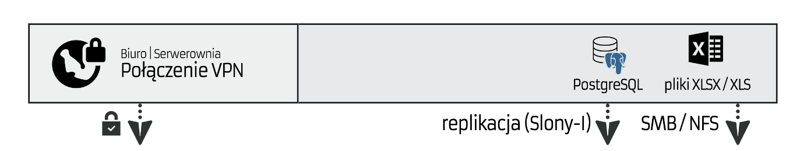

Pierwszy etap naszego projektu to dostarczenie w bezpieczny sposób do naszego serwera - danych, które posłużą nam do analiz. Użyjemy do tego celu bezpiecznego połączenia – przygotuj VPN (być może już go używasz). Dodatkowo zapoznaj się ze sposobami replikacji danych ([Slony-I][6]) w bazie PostgreSQL (lub innej wybranej przez Ciebie). Jeśli chciałbyś replikować bazy SQL Server w wersji Express (w tej wersji nie ma mechanizmów replikacji oferowanych przez samego SQL Servera), pomocny może okazać się [Microsoft Sync Framework][8]. Możesz również sam zaplanować inny sposób wymiany danych w bazie danych. Cel, jaki przed Tobą stoi, to szybka wymiana danych pomiędzy serwerami lokalnymi a serwerem e24cloud.com. Zadbaj o wymianę plików (arkusze kalkulacyjne, pliki CSV) – możesz skorzystać z protokołu NFS lub SMB ([jeśli SMB to zadbaj o aktualne aktualizacje Windows][24]) lub innego rozwiązania. W wykrywaniu zmienionych plików pomoże Ci [FreeFileSync][9] (można go używać z [wiersza poleceń][10])

Nie martw się, że masz do przeniesienia bardzo dużo danych. Zamiast przesyłać wszystko przez sieć – skontaktuj się z e24cloud.com i ustal czy możliwa jest wysyłka do nich (np. na DVD) zaszyfrowanych przy pomocy VeraCrypt backupów swoich baz danych – poproś o umieszczenie ich na wskazanym przez Ciebie i utworzonym w panelu: dodatkowym dysku twardym. Wtedy będziesz mógł je spokojnie rozpakować i zasilić bazę danych danymi przed pierwszą replikacją. Nie bój się negocjować i podejmować kontaktu. 

W kolejnych dniach danych do przeniesienia nie będzie dużo. Replikacja sprawi, że do wymiany przy pomocy sieci będzie dochodziło w przypadku niewielkiej część danych.

### Przygotowanie i uruchomienie maszyny wirtualnej z Windows
Przy pomocy [panelu e24cloud.com][11] stwórz i uruchom maszynę wirtualną. 

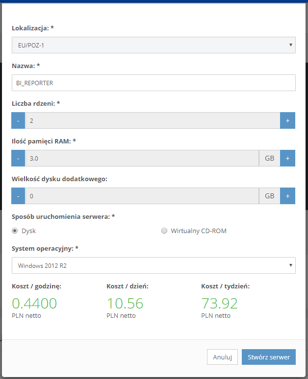

Ponieważ do analizy danych będziemy korzystać z Windows Server 2012 R2 i SQL Server wybrałem 3GB RAM oraz 2 rdzenie. Ustawiamy parametry i możemy uruchomić maszynę.

Pojawia się komunikat informujący o trwającej instalacji (jej proces przebiega dość szybko) – my w tym czasie skorzystajmy z ikonki ołówka po prawej, aby przejrzeć dostępne ustawienia.

Otrzymaliśmy adres IP – oczekujemy na instalację. W jednej z ostatnich sekcji ustawień utworzonego serwera znajduje się „Historia zdarzeń”, na której możesz śledzić aktualnie wykonywane prace. Gdybyś chciał uruchomić więcej niż jeden serwer, połącz je w jedną sieć przy pomocy „Sieci VLAN”. Pierwsza sieć VLAN jest darmowa!

Po zakończeniu procesu uruchamiania pojawi się dodatkowy pasek narzędzi obsługujący Twój nowy serwer: 

Użyj przycisku „Konsola”, aby obserwować start systemu oraz dokończyć proces instalacji. Ustaw hasło i włącz dostęp przy pomocy Pulpitu Zdalnego. Skonfiguruj środowisko pracy według potrzeb i Twoich preferencji. Od tej pory Twój serwer już działa!

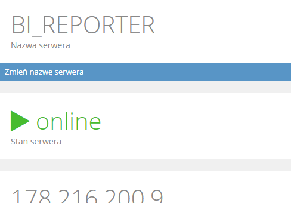

Możesz już wykorzystać klienta „Pulpitu Zdalnego” i przy pomocy publicznego adresu IP (Główny adres IP) połączyć się, ze swoim serwerem. 

W tej chwili aktywny koszt to koszt Twojego serwera oraz publicznego adresu IP. Widoczne jest to w sekcji: „Płatności”.

Czas na przygotowanie środowiska:

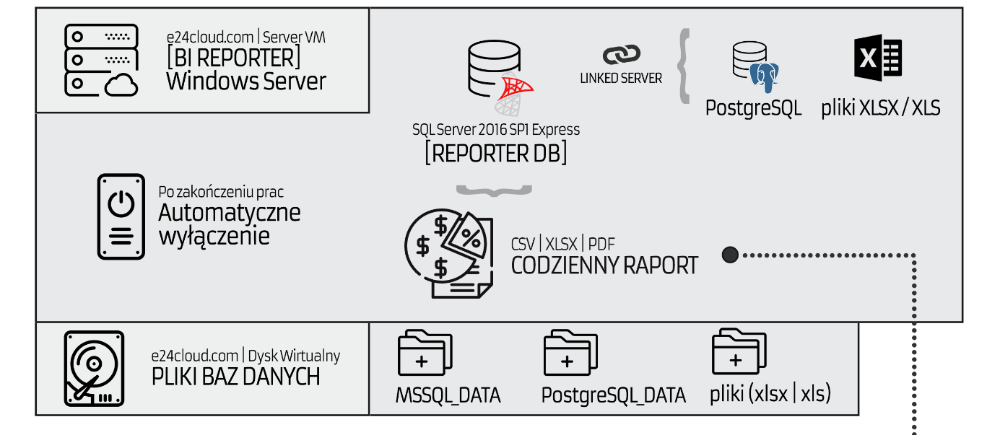

Pamiętaj o skonfigurowaniu firewalla – Twój serwer jest w tej chwili dostępny publicznie w sieci. Wykonaj instalację SQL Server 2016 SP1 – [pobierz pliki instalacyjne][12] . Poznaj trochę Power Shell – jeśli zupełnie nic na jego temat nie wiesz, skorzystaj z [kursu PowerShell na MVA][13]. 

Funkcjonalność która bardzo ułatwi Ci pracę to Linked Server ([więcej szczegółów][14]). Jest to mechanizm, który umożliwia podłączenie dowolnego źródła danych (do którego istnieją sterowniki, np. ODBC) jako serwera zlinkowanego z SQL Serverem. Dzięki czemu możemy w ramach zapytań wykonywanych w SQL Server odpytywać nie tylko inne serwery (nawet zdalne), ale również źródło danych uczynić z arkuszy kalkulacyjnych czy baz danych Access. [Tutaj dowiesz się][15] jak skonfigurować Linked Server dla PostgreSQL. Połączenie możliwe jest nie tylko przy pomocy sterownika PGNP, ale również przy wykorzystaniu ODBC (pobierz inny sterownik). Analogicznie możesz postąpić z [arkuszami kalkulacyjnymi czy plikami CSV][16]. Skonfiguruj odpowiednie połączenia do twoich baz i plików.

### Czas na dodatkowy dysk.

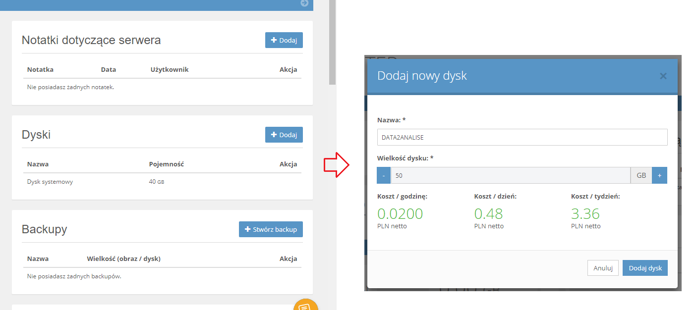

Skorzystaj z opcji serwera i dodaj kolejny dysk twardy. Po co?

Korzystając z infrastruktury e24cloud.com musisz zmienić podejście. Serwer w „chmurze” e24cloud.com to nie jest VPS. To usługa, która przez określony czas ma pracować dla Ciebie ciężko jak wół – zrobić swoje a potem się wyłączyć – nie chcesz przecież płacić za bezczynność? To jest właśnie przewaga naszego rozwiązania nad wstawieniem kolejnego serwera do Twojej firmy. Dodatkowy dysk to miejsce które:

* zapewni separację Twoich danych (plików baz danych, gotowych raportów, skryptów PowerShell, dodatkowych aplikacji czy bibliotek .dll) od Twojego „woła” – maszyny wirtualnej. Dzięki temu w razie awarii bardzo szybko możesz reinstalować maszynę wirtualną i podłączyć do niej ten dodatkowy dysk – dane pozostaną w niezmienionej formie, Ty musisz zadbać tylko o przywrócenie środowiska obliczeniowego
* Przeniesienie baz danych na inny dysk niż systemowy zapewni poprawę wydajności dla silnika bazodanowego. Tutaj można pokusić się jeszcze o zmianę miejsca przechowywania bazy tempdb – Tobie pozostawiam rozwiązanie tego zagadnienia.
* Jeśli dobrze zaplanujesz ten krok, dodatkowy dysk będzie miejscem w którym będziesz miał codziennie wykonywaną kopię zapasową danych z systemów Twojej firmy. (2 gr za godzinę dla 50GB miejsca na backup? – to 14,40 PLN miesięcznie)
* Uwaga! Pewnie wiesz, że przystawka „Zarządzanie dyskami” pozwala również na tworzenie macierzy RAID (software’owy RAID). Pomyśl, co możesz zrobić, podłączając do serwera kilka takich dodatkowych dysków…

W panelu e24cloud.com dodaliśmy nowy dysk. Gdzie on teraz jest? Zaloguj się do serwera, uruchom „Zarządzanie komputerem” (compmgmt.msc), następnie kliknij prawym klawiszem na dysku i wybierz „Online”. Ponów prawy klawisz i wybierz: „Zainicjuj dysk”. Potem wybierz: „Nowy wolumin prosty”, nadaj mu etykietę DANE oraz sformatuj (szybkie formatowanie).

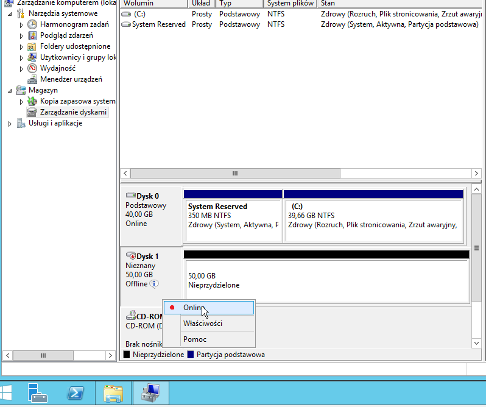

Twój dysk pojawił się w systemie i jest gotowy do pracy. Możesz na nim skonfigurować bazy danych oraz umieszczać swoje pliki i skrypty.

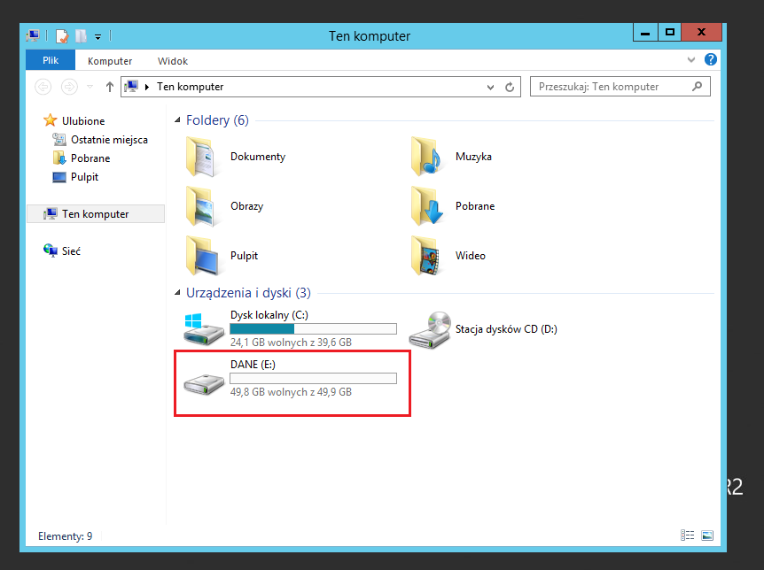

### Przechodzimy do analiz
Rozumiesz już co chcemy osiągnąć? Właśnie skonfigurowałeś system operacyjny oraz SQL Server jako główny serwer danych. W ramach jednego zapytania możesz scalić dane nie tylko z kilku baz danych, ale również plików. Reszta zależy od Twojej wyobraźni. Przeanalizuj jakich danych potrzebuje Twoja firma, przygotuj odpowiednie SQLe które scalą wszystkie zebrane źródła danych i przygotują wartościowe informacje. Przygotowując SQLe grupuj je w procedury składowane, których wyniki działania umieścisz w tabelach SQL Servera. Pamiętaj, że od wersji 2016 SP1 w wersji Express dostępne są tabele InMemory! Skorzystaj z nich dla bardziej złożonych obliczeń. 

Z doświadczenia wiem, że firmy które rozpoczynają przygodę z BIG DATA nie mają ogromnych potrzeb w zakresie analizy – ponieważ dopiero uczą się tego procesu. Jestem zatem pewny, że na początek kilka solidnie napisanych SQLi pozwoli na przygotowanie bardzo wartościowych raportów dla działu sprzedaży czy zarządu. Z każdym kolejnym dniem modyfikuj swój „system raportowy”, dodając do niego kolejne raporty. Raz na miesiąc spotkaj się z zarządem, aby ustalić jakie dane były najbardziej wartościowe i co jeszcze niosłoby dodatkowe informacje. Cel, który powinien Ci przyświecać, to połączenie danych z różnych systemów w celu wydostania wartościowych informacji dla biznesu.

Przygotuj skrypt PowerShell ([wywoływanie SQL przy pomocy PowerShell][17]), który wykona w odpowiedniej kolejności – przygotowane przez Ciebie procedury i ich wyniki zrzuci do określonych tabel z gotowymi raportami (skorzystaj w SQL Server z osobnego schematu, w którym umieścisz wyniki – [database schema][25]), a następnie drugi skrypt PS, który przy pomocy narzędzia [BCP – Bulk Copy Program][18] zapisze zawartość tabeli z wynikami do arkuszy kalkulacyjnych lub plików CSV.

Na koniec czas wykorzystać harmonogram zadań Windows, który po każdym uruchomieniu komputera odczeka 10 minut na uruchomienie procesów serwera, a potem po kolei będzie wykonywał następujące kroki:

1. Zestawienie połączenia VPN
2. Synchronizacja danych z baz danych
3. Synchronizacja plików
4. Uruchomienie analiz przy pomocy procedur w SQL Server
5. Zapisanie obliczonych danych w plikach – na dodatkowym dysku
6. Wysłanie danych na storage e24cloud.com – usługa „Pliki w chmurze”
7. Wyłączenie serwera

### Harmonogram zadań
W tej chwili zakończyliśmy główne prace nad uruchomieniem Twojej platformy analitycznej. Możesz zapytać: w poprzednim kroku wyłączyliśmy serwer, ale przecież coś musi go włączyć? Tutaj z pomocą przychodzi funkcjonalność e24cloud.com – Harmonogram zadań.

Ustawimy nasz serwer tak, żeby włączał się codziennie o godzinie 1:00. Obliczenia potrwają od kilkunastu minut do kilku godzin,  więc nad ranem nasz system zakończy swoje prace, a zarząd i managerowie otrzymają wartościowe dane.

W celu skonfigurowania Harmonogramu Zadań:

Wybierz nowe zadanie w sekcji Harmonogram Zadań.

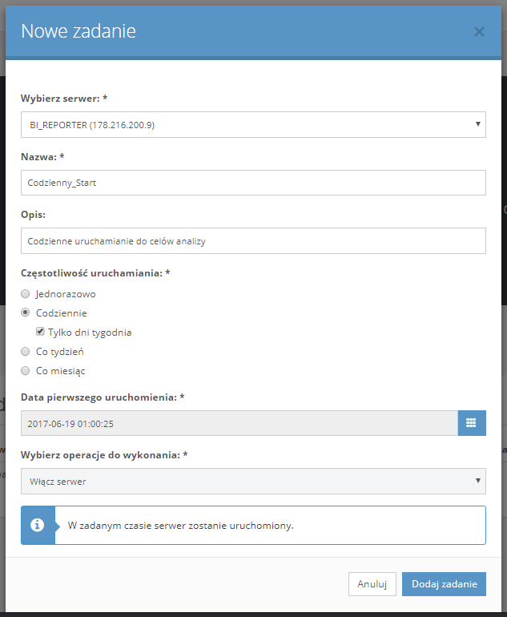

Ustaw uruchomienie serwera codziennie o 1:00. Możesz uruchomić to zadanie tylko w dni tygodnia (jeśli Twoja firma nie generuje danych w weekend). Na koniec zatwierdź zadanie.

### Raporty w „chmurze”
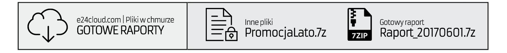

Główny etap prac mamy już zakończony. Mechanizm analizujący dane działa już automatycznie. Serwer włącza się o 1:00 rano, wykonuje swoją pracę i wyłącza się. Nie wspomniałem jednak do tej pory o jednym z punktów: „Wysłanie danych na storage e24cloud.com – usługa „Pliki w chmurze”.

Ponieważ nasz serwer po wykonaniu swojej pracy nie jest już dostępny, a my chcemy żeby wskazane osoby miały dostęp do przygotowanych danych – wykorzystamy usługę przechowywania plików w e24cloud.com aby udostępnić im dane. 

Dane niezbędne do połączenia do Twojego magazynu danych dostępne są tutaj:

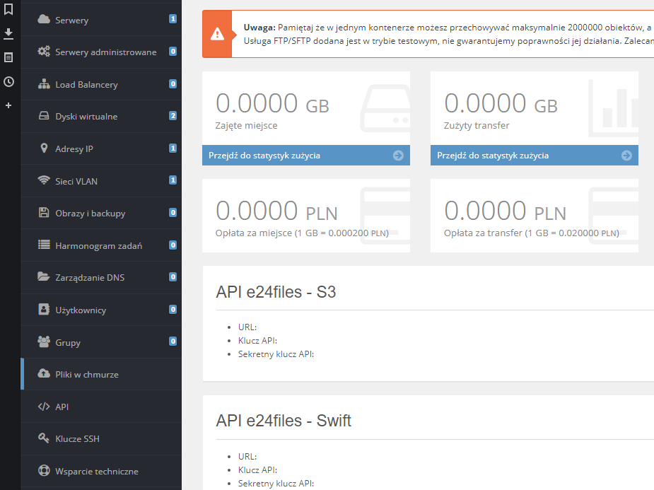

Wykonajmy brakujący krok – skonfigurujmy serwer do wrzucania plików z raportami do Twojego magazynu. Pobieramy i instalujemy program [Dragon Disk][19] (oficjalnie zgodny z [API e24cloud.com][20]):

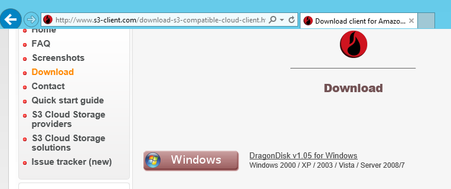

Następnie konfigurujemy konto w e24files:

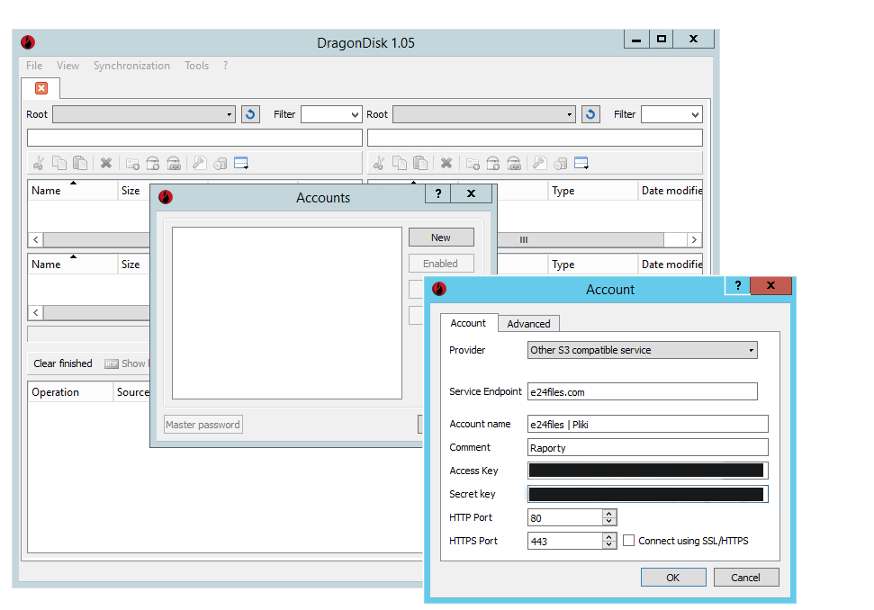

Możemy już korzystać z magazynu na pliki. Utworzyłem kontener rap01 i umieściłem w nim przykładowe pliki.

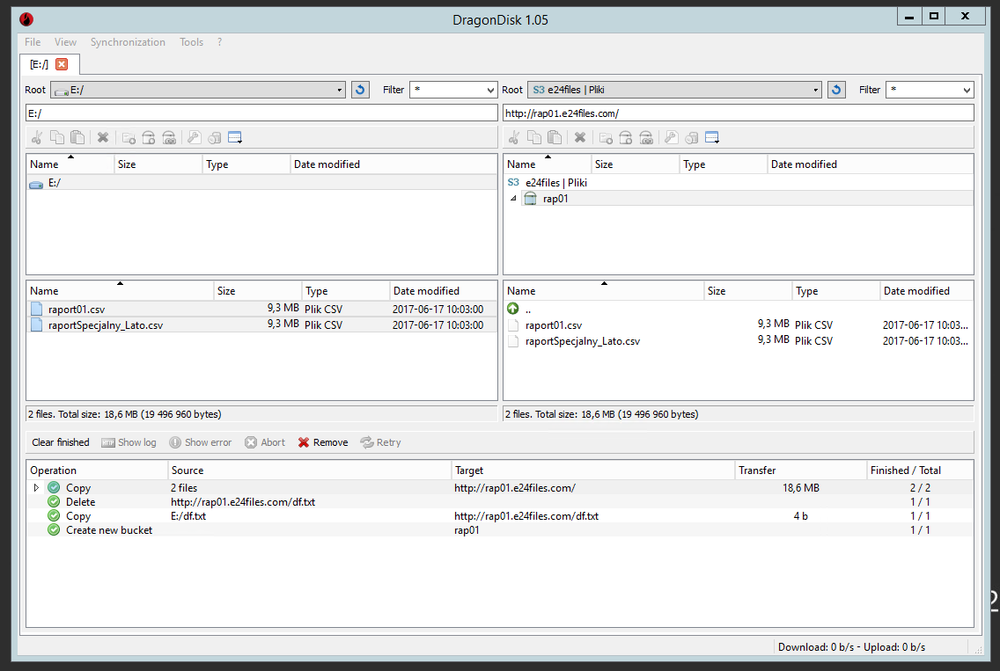

To, co jest najciekawsze – aplikacja umożliwia automatyczną synchronizację plików.

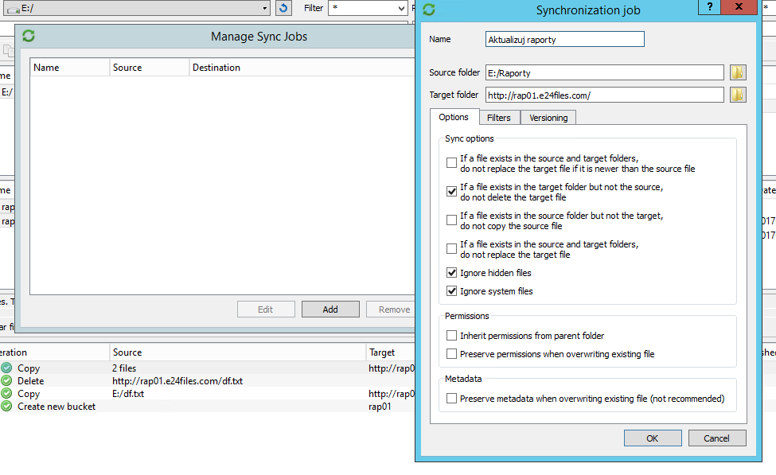

Dodatkowo można ją uruchamiać z wiersza poleceń, przy pomocy dgsync.exe

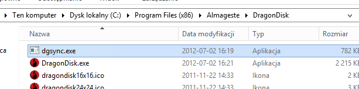

Wystarczy, że odpowiednio skonfigurujesz dgsync.exe jako krok w harmonogramie zadań Windows – i po każdym zakończeniu zadań serwera, wykonasz synchronizację plików w storage e24cloud.com.

Jeśli przeraża Cię konfigurowanie tych wszystkich zadań całkowicie ręcznie – skorzystaj z aplikacji, dzięki której cały proces będzie łatwiejszy [Desktop-Reminder][21] - lub innej o podobnej funkcjonalności.

### Raporty docierają „na biurko” zarządu i managerów.

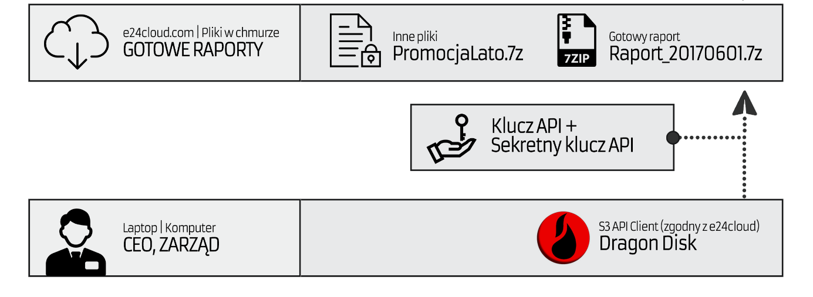

Ostatni etap to skonfigurowanie komputerów osób, które będą odbiorcami przygotowywanych raportów. Odbywać się to będzie w identyczny sposób, w jaki przygotowałeś to na serwerze analizującym. Ustaw w harmonogramie Windows synchronizację po uruchomieniu komputera do określonego katalogu na dysku. Prezes po uruchomieniu komputera, po kilku minutach będzie miał dostępny gotowy raport. 

Prawda, że to łatwe?

### Rozwój, modyfikacja parametrów maszyny wirtualnej
Po jakimś czasie może się okazać, że potrzeby raportowe wzrosną a w raz z nimi zapotrzebowanie na zasoby maszyny wirtualnej. Jak łatwo „wzmocnić” Twój serwer analizujący?

Przejdź do edycji ustawień serwera i wybierz opcję „Skaluj” dostępną przy ilości rdzeni i pamięci:

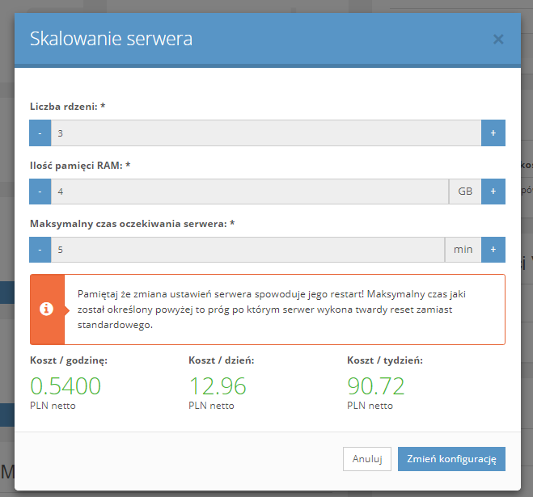

Wprowadź nowe ustawienia i zatwierdź je. Gotowe! Identyczne operacje możesz przeprowadzić też „w drugą stronę”.

### Cennik i dodatkowe koszty.
Dodatkowe koszty, o których do tej pory nie wspomniałem to: 
* transfer – Uwaga! Transfer przychodzący jest darmowy – a w naszym przypadku najwięcej ruchu będzie właśnie przychodzącego (replikacja bazy, synchronizacja plików). Dodatkowo w każdym miesiącu masz do dyspozycji 50GB darmowego transferu wychodzącego.
* „Pliki w chmurze” – 1GB za 0,0002 PLN
* dodatkowy dysk
* load balancer, powiadomienia SMS i inne

Więcej szczegółów znajdziesz w [cenniku e24cloud.com ][22]

### Podsumowanie

Pełny schemat naszego „systemu analitycznego” wygląda następująco:

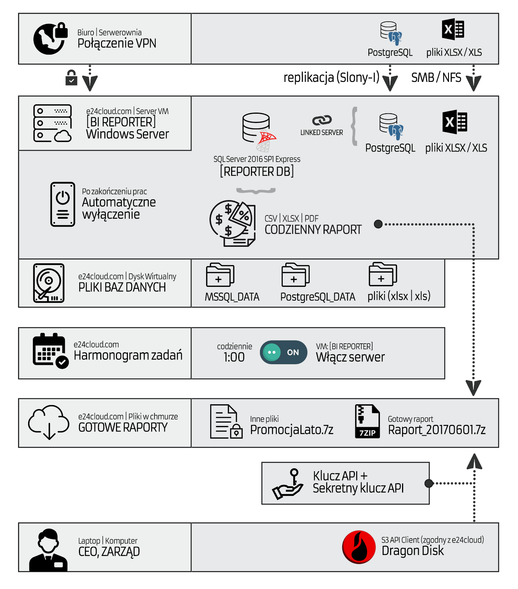

Wszystkie z przedstawionych scenariuszy są przykładowe. Jestem pewny, że będziesz potrafił dostosować go do własnych potrzeb i uczynić lepszym.

Podsumujmy (w przybliżeniu) również trochę koszty, jakie będzie generował nasz system. W tej chwili cennik przedstawia się następująco:

* maszyna wirtualna (gdy włączona) = 0,44 PLN / godzinę
* maszyna wirtualna (gdy wyłączona z przydzielonym IP) = 0,04 PLN / godzinę 
* adres IP = 0,02 PLN / godzinę (tylko dla maszyny włączonej)
* dodatkowy dysk 50GB = 0,02 PLN / godzinę
* storage „Pliki w chmurze” = 0.0002 PLN / 1 GB / godzina 
* transfer wychodzący = 50 GB / miesiąc / 0 PLN
* transfer wychodzący (ponad 50 GB) = 0,020 PLN / 1GB

Żeby lepiej zobrazować poziom kosztów, przedstawiam przybliżoną kalkulację dla naszego systemu:

Składnik| |Przewidywana, potrzebna ilość zasobów|Koszt jednostkowy|Koszt użycia
--- | --- | --- | --- | ---
Włączona maszyna wirtualna| M1 | 22 dni robocze x 4 godziny (czas obliczeń [od uruchomienia do wyłączenia serwera]) = 22 x 4 = 88 godzin | 0,44 PLN | 38,72 PLN
Wyłączona maszyna wirtualna	|M2 | 30 x 24 – M1 = 30 x 24 – 88 = 632 godziny	| 0,04 PLN |25,28 PLN
Adres IP | IP | Tylko gdy serwer włączony = M1| 0,02 PLN | 1,76 PLN
Dodatkowy dysk 50 GB | HDD2 | 30 dni x 24 godziny = 720 godzin | 0,02 PLN | 14,40 PLN
„Pliki w chmurze” | STOR | 30 dni x 24 godziny = 720 godzin Zakładamy, że raporty nie zajmują więcej niż 1GB (to pliki tekstowe) | 0,0002 PLN | 0,14 PLN
„Transfer wychodzący (ponad 50 GB)| OUT TR |Jeśli 3 członków zarządu/managerów pobierze 1GB 22 razy w miesiącu a Ty sam wygenerujesz 34 GB ruchu wychodzącego = (3 x 1GB x 22) + 40GB = 66 GB + 34 GB = 100 GB | 0,020 PLN (za transfer ponad 50GB)	| 1,00 PLN|
| | | | __Razem (miesięcznie) netto:__ | __81,30 PLN__
##### Dla obliczeń: doba = 24h, miesiąc = 30 dni

Lekko ponad 80 zł za elastyczny system analityczno-raportowy. Nie masz tutaj limitów na ilość generowanych raportów i ich rodzaje. Ogranicza Cię jedynie wyobraźnia (za miejsce czy cykle procesora dopłacasz stosunkowo niewiele). Dołożenie nowego raportu czy zestawu danych to trochę pracy, którą musisz wykonać – a nie konieczność zakupu nowego modułu / uaktualnienia.

### Na koniec
Zdaję sobie sprawę, że mój projekt nie jest idealny. Nie taki miał być. Chciałem pokazać, że mamy ogromne możliwości przy zachowaniu relatwnie niskich kosztów. Być może za jakiś czas potrzeby Twojej firmy okażą się większe niż opisane w takim scenariuszu. Ważne jest to, że do tego czasu zaoszczędzisz sporo pieniędzy na zbędną infrastrukturę i nauczysz się, jak wykorzystać e24cloud.com czy innego dostawcę do dostarczenia sobie mocy obliczeniowej i innych zasobów w celu jak najlepszego realizowania procesów w Twojej firmie. 

Jestem jeszcze winny odpowiedź na postawione przeze mnie wcześniej pytania. Mój projekt to wyciągnięta ręka w kierunku scenariuszy, w których boimy się inwestować w infrastrukturę i drogie systemy BI, a chcielibyśmy korzystać z ich dobrodziejstw. Jak widzicie, nie ma tutaj poważnych barier do pokonania. Potrzeba trochę czasu i chęci do nauki.
I co nie mniej ważne, taki system raportowy może kosztować tyle, co miesięczny abonament telefonii komórkowej.

Mam nadzieję, że udało mi się zaciekawić Cię tematem wykorzystania modelu IaaS. Może niedługo uznasz, że czas rozpocząć przygodę z PaaS czy innymi modelami?

Powodzenia!

Łukasz Piżuch

------------------------
###### Artykuł jest częścią konkursu organizowanego przez chmurowisko.pl oraz e24cloud.com. W trakcie projektowania w/w rozwiązania korzystałem z promocyjnej subskrypcji e24cloud.com.
###### Ikony użyte w schemacie systemu stworzyli autorzy zrzeszeni na portalu [Flaticon][26]. Schemat "systemu analitycznego" udostępniam na licencji MIT - proszę o zachowanie informacji o autorze.
###### Wszystkie pojawiające się w tekście znaki zastrzeżone i nazwy towarowe należą do ich właścicieli i zostały użyte jedynie w celach informacyjnych.

[1]: https://info.microsoft.com/CO-SQL-CNTNT-FY16-09Sep-14-MQOperational-Register.html?ls=Website
[2]: https://e24cloud.com
[3]: https://www.veracrypt.fr/en/Home.html
[4]: https://gpg4win.org
[5]: https://sekurak.pl/praktyczna-implementacja-sieci-vpn-na-przykladzie-openvpn/
[6]: http://www.slony.info
[7]: https://www.microsoft.com/en-us/download/details.aspx?id=54284
[8]: https://msdn.microsoft.com/en-us/library/bb902854(v=sql.110).aspx
[9]: https://www.freefilesync.org
[10]: https://www.freefilesync.org/manual.php?topic=command-line
[11]: https://panel.e24cloud.com
[12]: https://www.microsoft.com/pl-pl/sql-server/sql-server-editions-express
[13]: https://mva.microsoft.com/pl/training-courses/powershell-dla-pocztkujcych-14378
[14]: https://msdn.microsoft.com/pl-pl/library/ms188279(v=sql.110).aspx
[15]: https://blog.sqlauthority.com/2015/11/24/sql-server-how-to-create-linked-server-to-postgresql/
[16]: https://www.mssqltips.com/sqlservertip/2018/using-a-sql-server-linked-server-to-query-excel-files/
[17]: https://docs.microsoft.com/en-us/sql/powershell/invoke-sqlcmd-cmdlet
[18]: https://docs.microsoft.com/en-us/sql/tools/bcp-utility
[19]: http://www.s3-client.com
[20]: https://support.e24cloud.com/API_e24cloud
[21]: http://www.desktop-reminder.com/en/index.html
[22]: http://www.e24cloud.com/cennik/cennik-uslug/
[23]: https://sqlperformance.com/2016/11/sql-server-2016/big-deal-sp1
[24]: https://niebezpiecznik.pl/post/zamkniete-szpitale-i-zaklady-pracy-uderzenie-robaka-wannacry-i-olbrzymie-straty-na-calym-swiecie/
[25]: https://msdn.microsoft.com/pl-pl/library/dd207005(v=sql.110).aspx
[26]: http://www.flaticon.com